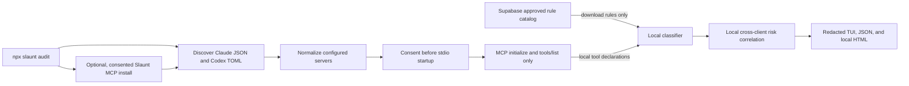

# Architecture

The privacy boundary is one-directional: approved rules may enter from Supabase, but tool declarations and findings do not leave the local process. No remote semantic RPC is used by the audit command.

## Components

- `src/config`: path discovery, JSON/TOML normalization, and backed-up atomic installation.
- `src/mcp`: consent-gated stdio and HTTP/SSE `tools/list` probes.
- `src/classification`: bundled rules, validated Supabase catalog downloads, caching, and local matching.
- `src/audit`: cross-server and cross-client capability correlation.
- `src/tui`: accessible terminal output with `NO_COLOR` support.
- `src/report`: a standalone, script-free, CSP-hardened HTML report.
- `supabase/migrations`: read-only approved catalog schema and seed rules.

## Trust decisions

- Configuration files are untrusted structured input and size-capped at 5 MiB.
- Catalog responses are schema-validated, capped at 2 MiB, limited to 10,000 rules, and matched as globs.
- Secrets are required only in memory for connecting to servers; serialized results contain placeholders.
- Remote redirects are rejected to prevent credential forwarding to an unexpected host.
- An unavailable tool inventory remains visible as an audit limitation.
